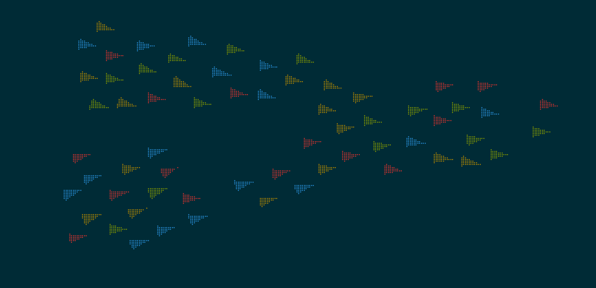

# vtrenderlib

vtrenderlib is a lightweight C library for drawing vector graphics directly in ANSI-compatible terminal emulators. It renders colored points, lines and filled polygons using braille characters, allowing programs to produce pseudo-graphics without leaving the terminal.

## Building

The project uses [CMake](https://cmake.org/) and builds a static library along with several demos. A typical build looks like:

```sh
mkdir build
cd build
cmake ..
cmake --build .
```

This will generate `libvtrenderlib.a` and a few example binaries under `demos/`.

## Demos

A set of small demos showcase various features of the library. The most featureful one is the **boids** simulation located in `demos/boids`:



Run it after building with:

```sh
./vt-boids
```

Use `-h` for a list of runtime options such as number of boids, debug vectors, colors and trails.

